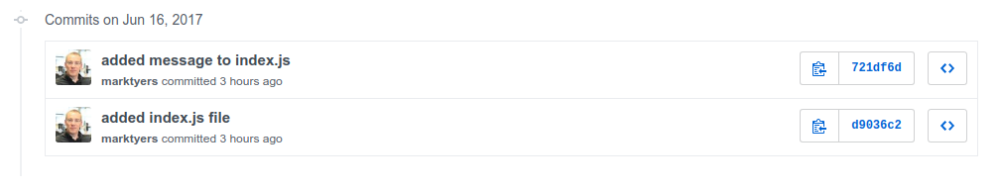

# Version Control

- Where is my code?
- My files are corrupted
- What has changed and when?
- I’ve broken my program and can’t fix it 
- I need to work on a different computer
- My team members are all working on the same file!
- Who has modified the files and when?
- Who has been doing the programming?

Revision control

- The management of changes to documents
- Each changes are usually identified by a revision number
- Each revision has a timestamp and the person responsible
- Revisions can be compared, restored, and merged

What is Git?

- Git is a version control system (VCS)
- It can help you keep track of files that are frequently changed
- It supports distributed development
- Its Open Source (you can download and install it for free)
- Alternatives: Mercurial, subverson (SVN)

In this chapter we will be covering the use of Git to version control our source code.

1. Working with Git Locally *
2. Git Remotes *
3. Branching
4. GitFlow

## 1 Working with Git Locally

Even if you are not working as part of a team, Git can offer a number of advantages. In this section you will learn how to use Git to manage your code within your local development environment.

### 1.1 Configuration

Before carrying out any work, the repository needs to be configured. This involves TODO

### 1.1 Test Your Knowledge

Create a new directory on your computer and, after navigating into it initialise an empty repository.
```shell
$ mkdir local_git/
$ cd local_git/
$ ls -a
  .  ..

$ git init
  Initialised empty Git repository in /home/johndoe/Documents/local_git/.git/

$ ls -a
  .  ..  .git
```
Running the `git init` command _initializes_ the repository and creates a new hidden directory called `.git/`. This contains all the information required to track your code changes.

next we need to add our user details and the preferred editor to the local configuration file which is kept in the `.git/` directory. Substitute your own name and email address. Since the **nano** text editor is far easier to use than the default **Vim** editor we will specify this as our default one. Finally we tell Git to cache our username and password for an hour (3600 seconds).
```
$ git config user.name "John Doe"
$ git config user.email 'johndoe@example.com'
$ git config core.editor 'nano'
$ git config credential.helper cache
$ git config credential.helper 'cache --timeout=3600'
$ git config --list
  credential.helper=cache --timeout=3600
  core.editor=nano
  user.name=John Doe
  user.email=johndoe@example.com
```

Now we will create a new document in the `local_git/` directory.
```
$ touch index.js
$ ls -a
  .  ..  .git  index.js
```
Git should have tracked the changes in the project directory and noticed that there is an additional file.
```
$ git status
  On branch master

  Initial commit

  Untracked files:
    (use "git add <file>..." to include in what will be committed)

  	index.js

  nothing added to commit but untracked files present (use "git add" to track)
```
As you can see, the new `index.js` file is not currently being tracked. Let's enable tracking for this file. This is done in two steps, files are staged and then the staged files are committed to the repository with a commit message that explains the changes.
```
$ git status
  On branch master

  Initial commit

  Changes to be committed:
    (use "git rm --cached <file>..." to unstage)

	  new file:   index.js

$ git commit
```
This will open the **Nano** text editor (the one we specified as our default) so we can add a commit message.
```

# Please enter the commit message for your changes. Lines starting
# with '#' will be ignored, and an empty message aborts the commit.
# On branch master
#
# Initial commit
#
# Changes to be committed:
#       new file:   index.js
#


                                           [ Read 10 lines ]
^G Get Help   ^O Write Out  ^W Where Is   ^K Cut Text   ^J Justify    ^C Cur Pos    ^Y Prev Page
^X Exit       ^R Read File  ^\ Replace    ^U Uncut Text ^T To Spell   ^_ Go To Line ^V Next Page
```
Enter the text `added index.js file` on the top line then save using _ctrl+o_ and finally quit using _ctrl+x_ (all available commands are listed along the bottom of the editor window). You will see the following message in the terminal window.
```
[master (root-commit) d9036c2] added index.js file
 1 file changed, 0 insertions(+), 0 deletions(-)
 create mode 100644 index.js
```
To see the most recent commits you can use the `git log` command.
```
$ git log
commit d9036c2bdf224ea72981eaa095ef76931c92e31d
Author: John Doe <ohndoe@example.com>
Date:   Fri Jun 16 09:04:00 2017 +0100

    added index.js file

```
If we check the status of the repository we should see that there are no further files to commit.
```
$ git status
On branch master
nothing to commit, working tree clean
```

Next we will edit the index.js file. You can either open it in a visual code editor or use `nano index.js`. Enter the following then save your changes.
```javascript
// this is a simple script to show how git works
console.log('Hello Git!')
```
If we check our repository status.
```
$ git status
On branch master
Changes not staged for commit:
  (use "git add <file>..." to update what will be committed)
  (use "git checkout -- <file>..." to discard changes in working directory)

	modified:   index.js

no changes added to commit (use "git add" and/or "git commit -a")
```
This time we will use a shortcut that stages the changes and makes a commit all from a single `git commit` command.
```
$ git commit -am 'added message to index.js'
  [master 721df6d] added message to index.js
   1 file changed, 2 insertions(+)
``` 
The `-a` flag automatically stages all modified files and the `-m` flag allows us to add the commit message without opening our text editor.
```
$ git log
commit 721df6dc9368bbe948be86fc19e696b7059dce5f
Author: Mark Tyers <marktyers@gmail.com>
Date:   Fri Jun 16 09:17:29 2017 +0100

    added message to index.js

commit d9036c2bdf224ea72981eaa095ef76931c92e31d
Author: Mark Tyers <marktyers@gmail.com>
Date:   Fri Jun 16 09:04:00 2017 +0100

    added index.js file
```
As you can see, there are now two commits in our repository. If there are too many commits to fit on the screen you can navigate using `space` for the next page, `w` for the previous page and `q` to quit.

## 2 Git Remotes

In the previous section you learned how to use Git to track local changes. In this section you will learn how to use remote git services.

You will be shown two ways to configure this depending on whether you already have a local Git repository. The examples will be using [GitHub](www.github.com) but these will work equally with other services such as [GitLab](www.gitlab.com) or [BitBucket](www.bitbucket.com).

TODO

```
git clone https://github.coventry.ac.uk/304CEM-1718SEPJAN/currency.git
```

### 2.1 Adding a Remotes

If you already have a local Git repository (such as the one in your `local_repo/` directory), you can connect this to a remote.

#### 2.1.1 Test Your Knowledge

Create an account on GitHub.com and log in. Click on the green **New repository** button and in the _Repository name_ field enter `remote-repo`. Leave the description blank and click on the green **Create repository** button.

near the top of the screen you will see a section called _Quick setup_ which will be displaying a url. There are two URLs, one uses HTTP and the other uses SSH/Git. Make sure the **HTTPS** option is selected and copy the url to the clipboard, it should look something like this.
```
https://github.com/johndoe/remote-repo.git
```
In the terminal, make sure you are still in the `local_git/` directory and add the GitHub remote to your project.
```
$ git remote
$ git remote add origin https://github.com/johndoe/remote-repo.git
$ git remote
  origin
```
The first time we view the remotes none are shown. We then add our GitHub remote and assign it the name `origin`, which is the standard name used by Git. If we now list the remotes we see that origin has now been added.

Finally we push our commits to the remote repository on GitHub.
```$ git push origin --all
  Username for 'https://github.com': johndoe
  Password for 'https://johndoe@github.com': 
  Counting objects: 6, done.
  Delta compression using up to 8 threads.
  Compressing objects: 100% (3/3), done.
  Writing objects: 100% (6/6), 506 bytes | 0 bytes/s, done.
  Total 6 (delta 0), reused 0 (delta 0)
  To https://github.com/marktyers/remote-repo.git
   * [new branch]      master -> master
 ```
 If we refresh the repository web page on GitHub you should see the `index.js` file. The complete repository has been pushed including both our commits which can be seen under the _commits_ tab.

 If you select the _commits_ tab you should see your profile picture and name next to each of the two commits.
 


 If this has not happened it means that the name and email you have stored in the local git config settings _don't match the details you have stored on GitHub_. You can't retrospectively fix the current commits but, if you update the local settings, all future commits will show your details correctly.

### 2.2 Cloning a Repository

TODO

```
$ git remote show
  origin
$ git remote get-url origin
  https://github.coventry.ac.uk/304CEM-1718SEPJAN/TEACHING-MATERIALS.git
```


## 2 Branching

List branches.
```
$ git branch
  * master
```

Display the branch structure in the log output:
```
git log --graph --abbrev-commit --decorate
  * commit 37cedee
  | Author: Mark Tyers <marktyers@gmail.com>
  | Date:   Sat May 27 10:45:54 2017 +0100
  |
  |     chapter 1 structure done
  |
  *   commit e90e847
  |\  Merge: 7b4e193 5a2aaad
  | | Author: Mark Tyers <marktyers@gmail.com>
  | | Date:   Sat May 27 08:38:00 2017 +0100
  | |
  | |     added more samples
  | |
  | * commit fa37b77
  | | Author: Mark Tyers <marktyers@gmail.com>
  | | Date:   Mon May 15 13:35:34 2017 +0100
  | |
  | |     completed first example
  | |
  * | commit 7b4e193
  |/  Author: Mark Tyers <marktyers@gmail.com>
  |   Date:   Sat May 27 08:35:07 2017 +0100
  |
  |       minor changes
  |
  * commit 40f08a9
  | Author: Mark Tyers <marktyers@gmail.com>
  | Date:   Sun May 14 15:50:00 2017 +0100
  |
  |     added content to chapter 1
  |

$ git log --graph --abbrev-commit --decorate --pretty=oneline
  * 480d68b chapter 2 structure complete
  * 37cedee chapter 1 structure done
  *   e90e847 added more samples
  |\
  | * 5a2aaad week 2 structure
  | * 085df46 finished chapter 1
  | * fa37b77 completed first example
  * | 7b4e193 minor changes
  |/
  * 40f08a9 added content to chapter 1

$ git log --all --decorate --oneline --graph
  * 37cedee chapter 1 structure done
  *   e90e847 added more samples
  |\
  | * 5a2aaad week 2 structure
  | * 085df46 finished chapter 1
  | * fa37b77 completed first example
  * | 7b4e193 minor changes
  |/
  * 40f08a9 added content to chapter 1
```

Remote Tracking Branches

If you check out a local branch Git automaticall creates a _tracking branch_ which is a local branch that has a direct relationship with a remote branch. This is why Git knows which branch to use when you run `git pull`. These branches are read-only and act as bookmarks to where your remote branches were last time you connected to them.
```
$ git branch --all
  * master
    remotes/origin/HEAD -> origin/master
    remotes/origin/master
```

You can get a list of the commits on the remote branch `git log origin/master`

TODO

## 3 Git Flow

GitFlow is a Git branching model developed by Vincent Driessen and is especially useful if you are collaborating with others and/or indending to implement either continuous integration or continuous deployment. It is assumed that you are comfortable 

The GitFlow branching model makes use of Git branches to provide a robust way to develop and deploy stable code by imposing a rigid approach in the use of branches. To support this, there is a git plugin which should be installed.
```shell
sudo apt-get install git-flow
```
Once the plugin is installed it provides a number of custom commands.
```
               A                             H    K           N
MASTER      ───⬤────────────────────────────⬤───⬤──────────⬤────
                │                            │    │  L    M   │
HOTFIX a        │                            │    ╰──⬤───⬤──┤
                │                         G  │                │
RELEASE 1.1     │                     ╭──⬤──┤                │
                │  B           E      │      │                │
DEVELOP         └──⬤──────────⬤─────⬤─────⬤───────────────⬤────
                    │  C    D   │     F      J                P
FEATURE A           ╰──⬤───⬤──╯ 
```
The diagram above shows a typical set of branches used in GitFlow. The first thing you will notice is that there are two _historical_ branches (ones that always exist). By default these are called `master` and `develop`. All the development takes place in the development branch with the master branch reserved for production-level code ready for release. When you initialise GitFlow on your project it will add this `develop` branch (A).

Since development happens in the `develop` branch, all feature branches originate from here (B) and once a feature is complete and fully tested it is merged back to the `develop` branch (E).

The process of releasing code is carried out by creating a **release** branch (F) and all final tests and bugfixes are carried out here (G). Once the team is happy that there are no more bugs and the code is ready for deployment, this branch is merged into both the `master` branch (H) but also back into the `develop` branch (J) so that any changes are available to the developers.

If any bugs are found in the `master` branch, a **hotfix** branch is created off the `master` branch (K), the bugs are fixed (L) (M) then the changes are merged back in to the `master` branch (N) and the `develop` branch (P).

### 6.1 Test Your Knowledge

```
git clone https://github.coventry.ac.uk/304CEM-1718SEPJAN/currency.git gitflow
```

1. Performing Git setup (name, email, editor, cache)
2. Install GitFlow `sudo apt-get install git-flow`
3. Initialise GitFlow `git flow init`, accepting the defaults for all the options.
```
$ git flow init
  Which branch should be used for bringing forth production releases?
     - master
  Branch name for production releases: [master] 
  Branch name for "next release" development: [develop] 

  How to name your supporting branch prefixes?
  Feature branches? [feature/] 
  Bugfix branches? [bugfix/] 
  Release branches? [release/] 
  Hotfix branches? [hotfix/] 
  Support branches? [support/] 
  Version tag prefix? [] 
  Hooks and filters directory? [/home/marktyers/Documents/currency/.git/hooks] 
```
If we list all the branches we will see that we still have the master branch and its matching remote but we now have a new local branch called `develop` and that this is the branch that is currently checked out:
```
$ git branch -a
  * develop
    master
    remotes/origin/master
```
The next step is to implement the three features, each will be in its own feature branch, the suggested branch names are shown:

1. modify the script to ask for the currency to convert to and display only the one conversion rate (`display-single-currency`).
2. instead of printing the exchange rate, ask for the amount to be converted and them return the equivalent in the chosen currency (`ask-for-amount`)
3. use the [OpenExchangeRates](https://openexchangerates.org/api/currencies.json) API to display the full name of the chosen currency (`show-full-currency-name`).

```
$ git flow feature start display-single-currency
  Switched to a new branch 'feature/display-single-currency'

  Summary of actions:
  - A new branch 'feature/display-single-currency' was created, based on 'develop'
  - You are now on branch 'feature/display-single-currency'
```

If we list our local branches you will see that there is a new branch and that it has been checked out.
```
$ git branch
    develop
  * feature/display-single-currency
    master
```
Your next step is to implement the feature. Remember to commit your code on a regular basis, you should aim to do at least 2 commits.

If you plan on collaborating with other developers on this feature you will need to _publish_ it. This will push the branch to your GitHub remote which means it will be available for the other developers to use. If you don't publish it it won't be visible on your GitHub remote.
```
git flow feature publish display-single-currency
```

Once the feature is completed you can finish the feature. This will open our default code editor (we specified the `nano` editor), accept the default commit message then save and quit the editor using `ctrl+o` and `ctrl+x`.
```
$ git flow feature finish display-single-currency
  Switched to branch 'develop'
  Merge made by the 'recursive' strategy.
   index.js   | 27 ++++++++++++++++++++-------
   3 files changed, 72 insertions(+), 7 deletions(-)
   create mode 100644 .eslintrc
   create mode 100644 .gitignore
  Deleted branch feature/display-single-currency (was cd5b304).

  Summary of actions:
  - The feature branch 'feature/display-single-currency' was merged into 'develop'
  - Feature branch 'feature/display-single-currency' has been locally deleted
  - You are now on branch 'develop'
```
Viewing the commit log you will see something like the following:
```
$ git log --all --decorate --oneline --graph
*   5928d5e (HEAD -> develop) Merge branch 'feature/display-single-currency' into develop
|\
| * cd5b304 prints single conversion rate
| * 4b6d5f0 isolates single currency
|/
* a443a19 (origin/master, master) Added main script file
```
As you can see, the new branch comes off the develop branch and then merged back into `develop` and the feature branch deleted.

Repeat this for the other two features ensuring you create a new branch for each of them.

Release

Once the features are implemented and tested it is time to create a release 1.0.0 using the features of GitFlow.
```
$ git flow release start 1.0.0
  Switched to a new branch 'release/1.0.0'

  Summary of actions:
  - A new branch 'release/1.0.0' was created, based on 'develop'
  - You are now on branch 'release/1.0.0'

  Follow-up actions:
  - Bump the version number now!
  - Start committing last-minute fixes in preparing your release
  - When done, run:

       git flow release finish '1.0.0'
```
If we list the local branches we will see that the feature branch is no longer available and that there is a new branch we will be using to finalise the release.
```
$ git branch
  develop
  master
* release/1.0.0
```
If you want other developers to work on the release you will need to _publish_ it. This will push the branch to your GitHub remote which means it will be available for the other developers to use. If you don't publish it it won't be visible on your GitHub remote.
```
git flow release publish '1.0.0'
```

When we carry out the final tests on our code we notice that it fails to exit cleanly when the script finishes. This is an issue that needs to be fixed before we can release the product to our end users! The solution is to include the following command immediately after the script displays the results to the user.
```
process.exit()
```
Add this line, test and then make a commit.

Now we can finish the release.

You will be prompted for the commit message (use the default) and will also be asked to provide a tag name, use `v1.0.0`.
```
$ git flow release finish '1.0.0'
  Switched to branch 'master'
  Your branch is up-to-date with 'origin/master'.
  Merge made by the 'recursive' strategy.
   index.js   | 28 +++++++++++++++++++++-------
   1 file changed, 28 insertions(+), 7 deletions(-)
   create mode 100644 .eslintrc
   create mode 100644 .gitignore
  Already on 'master'
  Your branch is ahead of 'origin/master' by 7 commits.
    (use "git push" to publish your local commits)
  Switched to branch 'develop'
  Merge made by the 'recursive' strategy.
   index.js | 1 +
   1 file changed, 1 insertion(+)
  Deleted branch release/1.0.0 (was 1677906).

  Summary of actions:
  - Release branch 'release/1.0.0' has been merged into 'master'
  - The release was tagged '1.0.0'
  - Release tag '1.0.0' has been back-merged into 'develop'
  - Release branch 'release/1.0.0' has been locally deleted
  - You are now on branch 'develop'
```
If we look at the commit graph we will see the entire commit history (yours will be longer than this:
```
$ git log --all --decorate --oneline --graph
  *   df496c8 (develop) Merge tag '1.0.0' into develop
  |\
  | *   12fe99c (HEAD -> master, tag: 1.0.0) Merge branch 'release/1.0.0'
  | |\
  | | * 1677906 fixed issue of script not exiting cleanly
  | |/
  |/|
  * |   5928d5e Merge branch 'feature/display-single-currency' into develop
  |\ \
  | |/
  |/|
  | * cd5b304 prints single conversion rate
  | * 4b6d5f0 isolates single currency
  |/
  * a443a19 (origin/master) Added main script file
```
And if we checkout the master branch we will see that it contains our working code including the release code.

### Hotfixes

Try running the script and input an invalid code, what happens. The chances are that the error message is printed but then the script continues to execute! This is a serious but in our release code and we will need to implement a _hotfix_.
```
$ git flow hotfix start '1.0.1'
  Switched to a new branch 'hotfix/1.0.1'

  Summary of actions:
  - A new branch 'hotfix/1.0.1' was created, based on 'master'
  - You are now on branch 'hotfix/1.0.1'

  Follow-up actions:
  - Start committing your hot fixes
  - Bump the version number now!
  - When done, run:

       git flow hotfix finish '1.0.1'
```
Now you need to fix the issue by adding the line `process.exit()` to each error handling block. Once you have finished, you need to commit the changes and then _finish_ the hotfix. Use the tag `v1.0.1`.
```
$ git flow hotfix finish '1.0.1'
  Branches 'master' and 'origin/master' have diverged.
  And local branch 'master' is ahead of 'origin/master'.
  Switched to branch 'master'
  Your branch is ahead of 'origin/master' by 7 commits.
    (use "git push" to publish your local commits)
  Merge made by the 'recursive' strategy.
   index.js    | 57 +++++++++++++++++++++++++++++++--------------------------
   1 file changed, 7 insertions(+), 7 deletions(-)
   create mode 100644 solution.js
  Switched to branch 'develop'
  Merge made by the 'recursive' strategy.
   index.js    | 57 +++++++++++++++++++++++++++++++--------------------------
   1 file changed, 7 insertions(+), 7 deletions(-)
   create mode 100644 solution.js
  Deleted branch hotfix/v1.0.1 (was 725b3ca).

  Summary of actions:
  - Hotfix branch 'hotfix/v1.0.1' has been merged into 'master'
  - The hotfix was tagged 'v1.0.1'
  - Hotfix tag 'v1.0.1' has been back-merged into 'develop'
  - Hotfix branch 'hotfix/v1.0.1' has been locally deleted
  - You are now on branch 'develop'
```
If you switch between the `develop` and `master` branches you will see that your _hotfix_ has been applied to both.

### Pushing the Tags

By default, all the tags are local only and don't get pushed to your GitHub remote. Lets start by listing the local tags.
```
$ git tag
  1.0.0
  1.0.1
```
And to see the tags on the remote (this returns nothing).
```
$ it ls-remote --tags origin
```
To push our tags to the remote.
```
$ git push origin --tags
```

```
$ git ls-remote --tags origin
  dd94793b69a8307157baf82011edfb2607b9b17a        refs/tags/1.0.0
  12fe99ca9326b10b54f1a06ccda7724694791e9d        refs/tags/1.0.0^{}
  0f3fbe765b99cab3039d35d8bdfdd912d5e5a9fa        refs/tags/v1.0.1
  53babbaeeb07a49def0e77405576a6a316750a8e        refs/tags/v1.0.1^{}
```
If you are using GitHub, these tags can be accessed under the **releases** tab where the tagged code can be downloaded.
