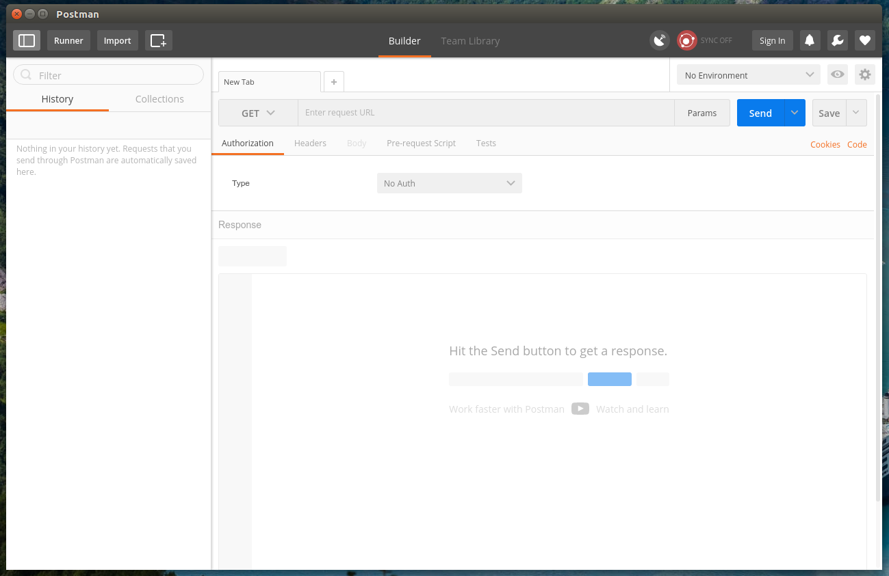

# Understanding APIs

The aim of this book is to teach you the principles and practical skills to build useful secure APIs but before we dive into the technical aspects we should take a step back and understand their purpose and how they should work. This chapter is slightly different from the others insofar as you will learn, not how to build an API but _why_ these are written and how they are used. The understanding you gain from this chapter will then help you design and build your own.

## 1 Configuring the Sample API

As you explore the features of a RESTful API you will be interacting with the **Bookshop API** which can be found at https://github.coventry.ac.uk/304CEM-1718SEPJAN/bookshop and will need to be downloaded and run on your computer. The following instructions show how to do this on an Ubuntu computer, you will need to adapt these if you are using a different operating system. It is assumed you have already installed a running version of MongoDB. If you have not yet done this, refer to chapter 7 (Data Persistence).

1. Start by cloning the repository into you Documents directory `git clone https://github.coventry.ac.uk/304CEM-1718SEPJAN/bookshop ~/Documents/bookshop`. This will create a `bookshop/` directory which you will need to navigate to using your terminal.
2. The API can run in one of two modes, `development` or `production`, and this is determined by the `NODE_ENV` environment variable. Set this to `development`.
3. Now you can start the API by running the `index.js` script.


## 2 Working with the HTTP Protocol

HTTP is an application protocol designed to support distributed hypermedia systems and is used when developing APIs so it is important that you have a good understanding of this.

Request-response.

HTTP Headers allow the client to pass additional information with the request and for the server to pass additional information in the response.

User agent

### 2.1 The Request

Request headers

### 2.2 The Response

Response headers


### 2.3 The User Agent

xxx

We will be using a console tool called `curl` as a _user agent_ to investigate the HTTP protocol. Run the following command to check it is installed.
```
$ curl
curl: try 'curl --help' or 'curl --manual' for more information
```
If you get a response of `command not found` or equivalent you will need to install it.
```
sudo apt-get update || sudo apt-get install curl
```

### Port in Use

Sometimes when a nodejs script crashes it keeps the port open which means you will get an error if you try to run your API.
```
Error: listen EADDRINUSE :::8080
```
To fix this you will need to find the PID (process ID) of the script currently using the port and kill it before running your API again.

To see what process is running on a given port (Ubuntu) we can use the [lsof](https://linux.die.net/man/8/lsof) (list open files). The `-i` lists all files of whose internet address matches the address specified (in our case we are looking for any files using the port 8080). Once we have the PID we can pass it to the [kill](http://manpages.ubuntu.com/manpages/xenial/man1/kill.1.html) tool.
```
$ lsof -i :8080
  COMMAND   PID    USER   FD   TYPE   DEVICE SIZE/OFF NODE NAME
  node    30135 johndoe   12u  IPv6 33466259      0t0  TCP *:8080 (LISTEN)
$ kill 30135
```

#### 1.4 Test Your Knowledge

We will practice using cURL using the Web API provided by [GitHub](https://github.com). Your first task is to make sure you have a valid login.
```
curl -iv https://www.google.co.uk

curl -X PUT -d arg=val -d arg2=val2 localhost:8080
curl -X POST -H 'Content-Type: application/json' example.com
curl -u username:password http:// (if only username will prompt for pw)
```

## 2 What is an API?

An API (Application Program Interface) is a piece of software that makes itself available over the Internet. Most APIs use open standards which means that the API can be used by a wide range of client applications. Any piece of software that communicates across the Internet will be using an API to achieve this.

The range of applications is huge:

- It allows social media platforms to share data between users.
- They allow e-commerce to be offered on a range of different platforms
- They allow supermarkets to automate stock re-ordering

There are huge benefits to using APIs:

- All the core business logic can be centralised.
	- It only needs to be written once (in one language)
	- It can be effectively secured
	- The same business logic can be shared between clients running on different platforms and written in different programming languages.
	- It allows different clients to communicate with each other regardless of the language they were written in.

As you can see, there are very few areas of our lives untouched by APIs, yet, because they are not visible to the end users, most are completely unaware of their existence. By learning how to design and build APIs you will find yourself very much in demand.


### 2.1 Distributed Application

People who are new to programming often write _monolithic_ applications, that is applications where all the code is bundled up together. A much better solution is to split the code up into different parts, each responsible for a different aspect. One of the first approaches was called **3-Tier Architecture** where the code was split into three _layers_ and it can help to see how Web APIs fit into this.

The three tiers are:

- Presentation
  - The web service client (desktop browser, smartphone, etc.). Because a Web API uses open standards, they can support many different clients written in multiple languages and running on different platforms as long as they have web connectivity (and support the HTTP protocol).
- Business logic
  - The web API runs on a web server. It receives requests from the different clients over HTTP, processes them (saving and retrieving data from the persistence tier) and sends data back to the clients.
- Persistence
  - This is where the data gets stored. This can include user credentials as well as the data needed. There are many different ways to persist data ranging from saving it to the file system through to relational, document and graph databases.


## 2.2 Web Services vs Web APIs

As you dig into the subject you will come across two different names, web services and web APIs, so what is the difference? The source of this confusion is historical. 

Early web services used the Simple Object Access Protocol (SOAP) developed by Microsoft, which provides an XML messaging protocol layer. It consists of:

1. An envelope that defines the message structure.
2. A set of rules for expressing different data types.
3. A way to represent calls and responses.

The SOAP protocol can operate over several different protocols such as SMTP and UDP but is most commonly run over HTTP.

Whilst SOAP worked well it was felt to be over complex and so has been superceded by a different type of web service called Representational State Transfer (REST). To avoid confusion, the convention has been to refer to SOAP-based solutions as _Web Services_ and REST-based solutions as _Web APIs_ and this book will be adhering to this convention.


## 3 Representation State Transfer (REST)

This book will focus on the design and development of RESTful APIs. The purpose of an API is to allow clients (such as websites and smartphone apps) to interact with web-based resources.

The REST principles were first discussed by Roy Fielding, an American Computer Scientist who helped author the HTTP Specification and co-founded the Apache project. He first described the REST principles in his [PhD Thesis](https://www.ics.uci.edu/~fielding/pubs/dissertation/fielding_dissertation.pdf).

The aim is to create a program on the server that can be accessed by different clients regardless of the language or platform used. For this to happen we need to be able to:

1. Specify the online resource we want to interact with.
	- By being able to define any online resource uniquely we can access it from anywhere.
2. Specify the action we want to take.
	- By agreeing a set of methods we can perform actions on these resources.
3. Agree on the protocol we will use to send and retrieve data.
	- By using the HTTP protocol, any computer can access any resource using any language.
3. An agreed format for the data.
	- By using a standardised data format it can be understood by any client computer
4. A way to flag the result of the interaction.
	- We need an agreed set of success and error codes so we know the outcome of the action.
5. Connectedness
	- If there are relations between different resources these need to be visible.
6. Statelessness.
	- Each request should contain all the information needed so we don't need to keep track of the user on the server.

We will be covering these points one by one.

RESTful APIs make use of the HTTP protocol precisely because this protocol already addresses these four points.


### 3.1 Resources and Collections

In the HTTP protocol a URL uniquely identifies a _resource_, whether an HTML document or a JPEG image. When you enter a URL you expect to get the resource returned. If we extend this concept we can create a URI to uniquely locate anything on the Internet. This principle is called _addressibility_.
```
http://www.bookshop.com/books/1449358063
```
This uniquely locates the book _Restful Web APIs_ within the _books_ collection.

Notice the structure of the URL defines this resource as being part of a _books_ collection. In a RESTful API, all resources should belong to a _collection_ which can be ordered and filtered. In our example, to access the `books` collection we would use the URL.
```
http://www.bookshop.com/books
```
This would return a list of _all_ the books in the collection. Obviously in a real API with thousands of books it would be possible to pass a search parameter and it might also offer the option to paginate the result (only show 20 at a time for instance).

#### 3.1.1 Uniform Resource Identifiers

We have been referring to URLs however this terminology is not technically accurate. The [RFC 3986](https://tools.ietf.org/html/rfc3986) document refers to **URIs**. These are described as _a compact sequence of characters that identifies an abstract or physical resource_. A URL is a sub-classification of a URI which can be sub-classified as either a URL or a URN.

| Classification | Name    | Description                             | Example |
| -------------- | ------  | --------------------------------------- | ------- |
| URL            | locator | identifies the _location_ of a resource | http://example.com/index.html |
| URN            | name    | defines a resource's _identity_         | http://example.com/books/1449358063 |

So a _URL_ describes _where the item is located_, in the example above it describes where to find the text file called `index.html` whilst a _URN_ defines a book with the ISBN of 1449358063 but does not describe where this data is stored.

In conclusion therefore we should be using the term **URN** when working with RESTful web APIs and we will be using this convention for the remainder of the book.


### 3.2 Actions

For an API to be useful we need to be able to carry out actions on the resources and collections. The core actions are:

| Action   | Description                                                         |
| -------- | --------------------------------------------------------------------|
| Create   | we need to be able to add new resources to our collections.         |
| Retrieve | we need to be able to retrieve collections and resources.           |
| Update   | any existing resources need to be able to be updated.               |
| Delete   | and finally we need a way to delete resources from our collections. |

Just as the HTTP protocol allows us to uniquely address resources and collections through _URNs_, it also includes a set of standard _actions_ called **methods** that we can use to describe the action we wish to take. Whilst there are a lot of methods, there are four core ones that correspond to the _CRUD_ operations described above. The descriptions are taken from the [official documentation](https://www.w3.org/Protocols/rfc2616/rfc2616-sec9.html).

| Method | Action   | Description |
| ------ | -------- | ------------|
| POST   | Create   | request that the origin server accept the entity enclosed in the request as a new subordinate of the resource identified by the Request-URI in the Request-Line |
| GET    | Retrieve | retrieve whatever information (in the form of an entity) is identified by the Request-URI |
| PUT    | Update   | the enclosed entity be stored under the supplied Request-URI |
| DELETE | Delete   | requests that the origin server delete the resource identified by the Request-URI |

#### 3.2.1 Methods for Collections

Two actions:

- GET		Retrieve the collection
- POST	Add a new resource to the collection

#### 3.2.2 Methods for Resources

Three actions:

- GET			Retrieve the resource
- PUT			Update the resource
- DELETE		Remove the resource

#### 3.2.3 Idempotent Methods

An idempotent method means that the result of a successful performed request is independent of the number of times it is executed

Gregor Roth

- GET
- DELETE
- PUT

Idempotent methods can be retried on failure safely

#### 3.2.4 Safe Methods

GET cannot change a resource

This makes it SAFE

DELETE, PUT, POST can change a resource

These are UNSAFE


### 3.3 Response Codes

If something goes wrong we need to get an error code from the server so we understand the problem

The HTTP protocol already defines a large number of HTTP status codes...

LIST OF COMMON STATUS CODES


### 3.4 JSON Strings

We have already defined the structure of our request

This takes the form of a URI

The data we get back also needs to be in a standard format

This will allow it to be understood by the client computer

There are two possible formats:

XML or JSON

Most web services use the JSON format

JavaScript Object Notation
```json
{
  "records": 2,
  "books": [
	{
	  "isbn": "9780340881538",
	  "title": "The Recruit",
	  "author": "Robert Muchamore"
	},
	{
	  "isbn": "9780340881545",
	  "title": "Cherub",
	  "author": "Robert Muchamore"
	}
  ]
}
```

### 3.5 Connectedness

Sometimes the data may contain links to more data

Google search results

Bookshop list of books may contain title and author plus a link to the details of each book

The Uniform Interface

There are only a few things we can do to a resource

- Retrieve its representation
- Create a new resource with new URI
- Create a new resource with an existing URI
- Modify an existing resource at a URI
- Delete a URI


### 3.6 Statelessness

Does the web service remember the preceding events

A stateless server knows nothing about the user

Each request must contain all the information needed to process the request

Allows service to be infinitely scalable

Two types of state:

Application state

Does the web service store information about the activities carried out

Resource state

Does the web service track changes to the resources accessed


## 4 The Tools

Because Web APIs are designed to be understood primarily by computers you will need to install some software to allow you to interact with the APIs in this chapter. We will be using two **HTTP clients** and our first task is to make sure these are installed and working.

### 4.1 cURL

The first of these is a console tool called `curl`. Run the following command to check it is installed.
```
$ curl
curl: try 'curl --help' or 'curl --manual' for more information
```
If you get a response of `command not found` or equivalent you will need to install it.
```
sudo apt-get update || sudo apt-get install curl
```

#### 4.1.1 Test Your Knowledge

We will practice using cURL using the Web API provided by [GitHub](https://github.com). Your first task is to make sure you have a valid login.

### 4.2 Postman

The second tool is called [Postman](https://www.getpostman.com/). It is a powerful graphical HTTP client and is available both as a native tool for Linux, MacOS and Windows but also as a Chrome browser plugin. Make sure this is installed. It should look like this when running.



#### 4.2.1 Test Your Knowledge

xxx
